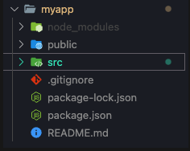

### Simple steps to start your react project.

Before that make sure you have nodeJS installed in your system.

1. open a folder using VSCode
2. open the console and write

   if you want to create a new separate folder name ->
   ==**npx create-react-app foldername**==  OR

   if you want to create your react project in the existing folder ->
   ==**npx create-react-app .**==

You will have all these folders.



3. if you want to run the project, write **==npm start==** in the console. make sure you are in the react-project folder.

You can delete these files if you do not need them.

1. from public folder

- everything except the index.html
- you are going to need manifest.json in future but for now delete it.

Inside the index.html delete the codes and make it clean like this:

```html
<!DOCTYPE html>

<html lang="en">
  <head>
    <meta charset="utf-8" />
    <meta name="viewport" content="width=device-width, initial-scale=1" />
    <meta name="theme-color" content="#000000" />
    <title>React App</title>
  </head>

  <body>
    <noscript>You need to enable JavaScript to run this app.</noscript>
    <div id="root"></div>
  </body>
</html>
```

2. from src folder

- delete everything but keep 2 files - app.js and index.js
- in your ==App.js== only keep the following codes-

```js
function App() {
  return <h1>hello</h1>;
}

export default App;
```

- in your ==index.js== keep the following codes-

```js
import React from "react";
import ReactDOM from "react-dom/client";
import App from "./App";

const root = ReactDOM.createRoot(document.getElementById("root"));

root.render(<App />);
```
