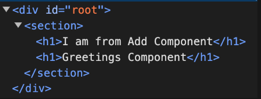

We know that we have to wrap mutiple divs/ components inside a main wrapper.



Here section is the main wrapper but in many react websites you will notice that without declaring any main sections the components are wrapped up. So behind the scenes, fragment is used.

#### How to?

1. Import it from React
2. Enclose your components to the fragment

```js
import Add from "./components/Add.js";
import Greetings from "./components/Greetings.js";
import { Fragment } from "react";

function App() {
  return (
    <Fragment>
      <Add />
      <Greetings />
    </Fragment>
  );
}
export default App;
```

Now you will notice that the section is gone.


### But this is an old way. New easier way to use fragment:

You do not need to import anything.
Just close it with empty element tags.

```js
import Add from "./components/Add.js";
import Greetings from "./components/Greetings.js";

function App() {
  return (
    <>
      <Add />
      <Greetings />
    </>
  );
}
export default App;
```
