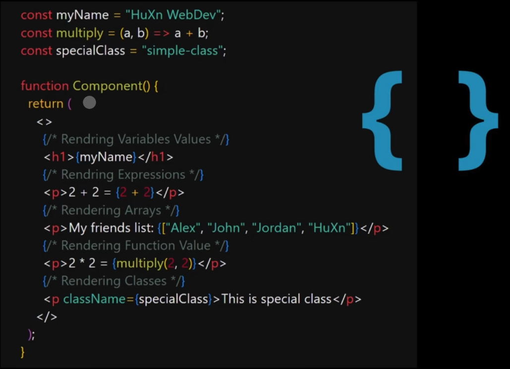
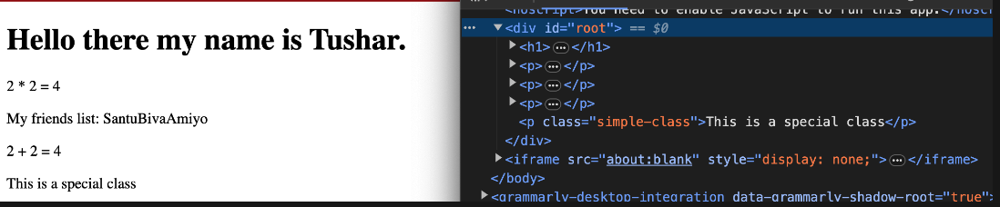

With JSX **you ==can write expressions inside curly braces**==. The expression can be a React variable or property, or any other valid JavaScript expression. JSX will execute the expression and return the result.

Example,



Code:

```js
const myName = "Tushar";
const multiply = (a, b) => a + b;
const specialClass = "simple-class";
//
const Expressions = () => {
  return (
    <>
      <h1>Hello there my name is {myName}.</h1>
      <p>2 * 2 = {multiply(2, 2)}</p>
      <p>My friends list: {["Naruto", "Batman", "Aragon"]}</p>
      <p>2 + 2 = {2 + 2}</p>
      <p className={specialClass}>This is a special class</p>
    </>
  );
};

export default Expressions;
```

Output:

