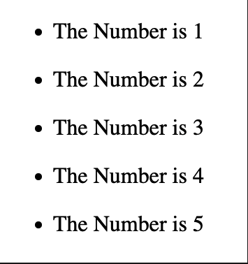
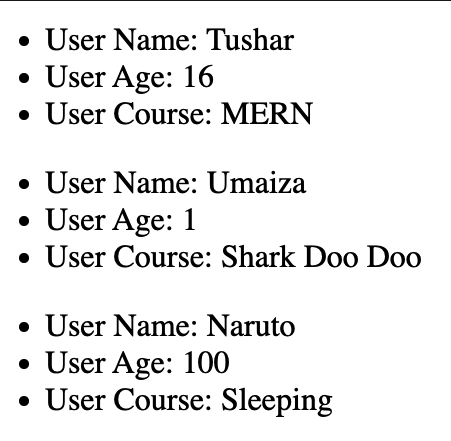

In React, you will render lists with some type of loop. The JavaScript map( ) array method is generally the preferred method.

### Example-01

Creating a List component in separate Js file.

```js
const Lists = () => {
  // Example 01
  const numbers = [1, 2, 3, 4, 5];

  return (
    <>
      {numbers.map((number) => (
        <ul key={Math.random() * 10}>
          <li>The Number is {number}</li>
        </ul>
      ))}
    </>
  );
};
```

NOTICE: we have used a 'key' attribute to the ul because while generating ULs in JSX, each UL must have an unique key to it. Although Math.random is a horrible practice, we are using it to keep it simple for now.

Importing it to the App.js

```js
import Lists from "./components/Lists";
function App() {
  return (
    <>
      <Lists />
    </>
  );
}
export default App;
```

Output:



NOTICE: in map method inside we used to use curly braces and the use a return keyword but in React we can directly use angle brackets and no need to declare the return keyword inside.

### Example-02

```js
const Lists = () => {
  const users = [
    {
      name: "Tushar",
      age: 16,
      course: "MERN",
    },
    {
      name: "Umaiza",
      age: 1,
      course: "Shark Doo Doo",
    },
    {
      name: "Naruto",
      age: 100,
      course: "Sleeping",
    },
  ];
  return (
    <>
      {users.map((user) => (
        <ul key={Math.random() * 10}>
          <li>User Name: {user.name}</li>
          <li>User Age: {user.age}</li>
          <li>User Course: {user.course}</li>
        </ul>
      ))}
    </>
  );
};

export default Lists;
```

in App.js

```js
import Lists from "./components/Lists";
function App() {
  return (
    <>
      <Lists />
    </>
  );
}
export default App;
```

output:


